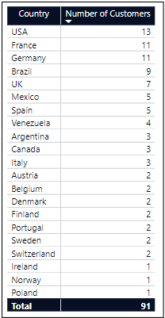
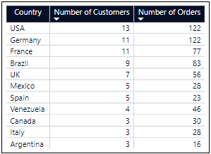
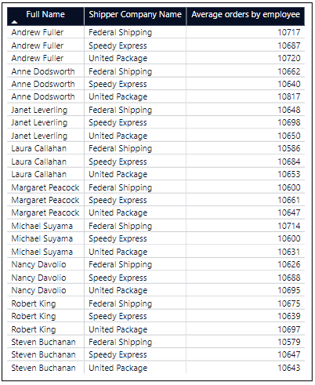
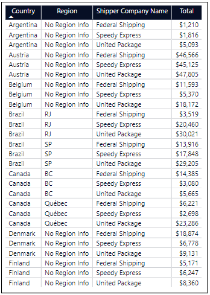
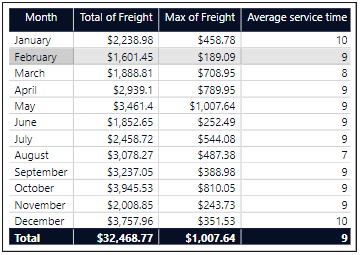

# NorthWind Database (Part 1)

In this project, the proposed task will aim to practice various topics and apply them using the Northwind database. Therefore, more in-depth analyses will be set aside for future projects using this same database.

Before starting the project, we will take a look at the structure of the database, its entities, and the relationships between them. Initially, we can say that the fact table is the "order_details" table, where the details of each order are presented. In this fact table, we find the quantities and prices of each product, along with the order number and applied discounts.

The rest are dimensional tables, and based on the design of the database, we can say it is a snowflake schema.

### The questions I wanted to answer with SQL Queries were:

1. How many customers are there per country?
2. What are the top 10 countries with the highest number of orders placed? Additionally, also relate the number of customers.
3. What is the average number of orders placed by employees (full name) and by each of the shippers?
4. What is the total sales amount (without discount) by country, region, and shipper company?
5. What is the total freight value, its maximum value, and the average service time of the company (days between order date and shipping date) for each year and month?

# Tools I used

These are the tools were used in this analysis:

- **SQL:** It is the central tool for analysis, where DML (Data Manipulation Language) queries were used to query the database. DDL (Data Definition Language) was also generated to create the database, tables, and constraints.
- **Power BI:** This tool was used to create tables in this particular project, in next project I will take advantage of the Power BI capabilities.
- **PostgreSQL:** This was the chosen database management system for database creation, and its versatility enabled a strong connection with Visual Studio Code.
- **Visual Studio Code:** This is the most widely used code editor currently, and due to its high customizability, it was selected as the tool for writing queries.
- **Git & GitHub** These tools were used in the project as version control applications, allowing for both local and remote storage and management of the project.

# Analysis

In this analysis, we must keep in mind that as previously mentioned, this project is more focused on practicing SQL concepts rather than conducting an extensive analysis of the NorthWind database. For this reason, we used 5 entities to answer my questions, which were: Customers, Orders, Shippers, Employees, and Order_details.

### 1. How many customers are there per country?

The question aims to determine the distribution of customers by country. This will allow us to understand whether customers are concentrated in one country or evenly distributed.

```sql
SELECT country, count(*) Qty
FROM customers
GROUP BY country
ORDER BY Qty DESC;
```

The query shows the distribution of customers, where we can see that the country with the highest number of customers is the USA with 13, followed by a progressive decrease in Germany, France, and others.



_Table showing the number of clients by country_

### 2. What are the top 10 countries with the highest number of orders placed? Additionally, also relate the number of customers.

In theory, countries with the highest number of customers should be the countries with the highest number of orders, which is why the following query helps us validate this statement.

```sql
SELECT
    c.country,
    COUNT(DISTINCT c.CustomerId) AS Qty, COUNT(o.OrderID) AS Orders
FROM customers AS c
LEFT JOIN orders AS o
ON c.CustomerId = o.CustomerId
GROUP BY c.country
ORDER BY Qty DESC
LIMIT 10;
```

In general, the initial expectation holds true, where countries with a higher number of customers generate a greater number of orders, with the exception of Germany, which matches the USA in the number of orders and significantly exceeds the number of France, despite having the same number of customers.



_Top 10 customer countries with the highest number of orders and number of customers._

### 3. What is the average number of orders placed by employees (full name) and by each of the shippers?

In this question, we seek to determine if there is a significant difference between the number of orders processed by employees. Initially, I believe that under normal conditions, such differences should not exist.

```sql
SELECT
    CONCAT(e.firstname, ' ', e.lastname) AS Name,
    s.companyname AS ShipperName,
    ROUND(AVG(o.orderid), 0) AS avg_ordersByEmployee
FROM employees AS e
JOIN  orders AS o
ON e.EmployeeId = o.EmployeeId
JOIN shippers AS s
ON s.shipperId = o.shipperId
GROUP BY Name, ShipperName
ORDER BY Name, avg_ordersByEmployee DESC
```

As initially thought, employees on average do not have significant changes in the number of orders handled; in fact, it is quite intriguing that their distribution among the shipping companies is so uniform.



_Table that shows the average number of orders processed by each employee and the shipper company used in the process._

### 4. What is the total sales amount (without discount) by country, region, and shipper company?

In this question, we seek to understand the information about suppliers, their sales, and their relationship with shipping companies. However, it is important to note that in some countries we do not have information about their regions, which is only presented as an aggregate.

```sql
SELECT
    CASE
        WHEN o.shipcountry = 'USA' THEN 'United States of America'
        WHEN o.shipcountry = 'UK' THEN 'United Kingdom'
        ELSE o.shipcountry
    END AS valid_contry,
    COALESCE(o.shipregion, 'No Region Info') valid_region,
    s.companyname deliver_company,
    SUM(od.unitprice * od.quantity)::money total
FROM orders AS o
JOIN orders_details od
ON o.orderId = od.orderId
JOIN shippers s
ON o.shipperId = s.shipperId
GROUP BY valid_contry, valid_region, deliver_company
ORDER BY valid_contry, valid_region, total DESC
```

The query shows us that some regions may have a more centralized use of one shipping company compared to others, which could be due to shorter delivery times or better prices for the service.



_Table that presents the total value of orders placed by country, region and shipper company._

### 5. What is the total freight value, its maximum value, and the average service time of the company (days between order date and shipping date) for each year and month?

The last query is conducted to study transportation costs and response times between the order date and the shipping date.

```sql
SELECT
    EXTRACT(MONTH FROM orderdate) AS month_number,
    TO_CHAR(orderdate, 'Month') AS month_name,
    SUM(freight)::money AS total_freight,
    MAX(freight)::money AS max_freight,
    ROUND(AVG(Extract(DAY FROM AGE(shippeddate, orderdate))),0) AS avg_of_service_time
FROM orders
WHERE EXTRACT(YEAR FROM orderdate) = 1997
GROUP BY month_number, month_name
ORDER BY month_number
```

According to the query, we can interpret that the busiest months in 1997 were August, September, and October. In terms of the maximum monthly freight value, May stands out as the highest month of the year, with $1,007. On average, we can say that the service time ranges from 7 to 9 days for all months, which indicates that it is apparently not very fluctuating.



_Table that represents the total expenses in transportation, maximum value and average service time (days of processing an order) for each month_

# What I learned

In this project, several topics have been presented that have helped me better understand the structure and composition of tables and their relationships. Since the Northwind database uses a variety of entities (tables), it allowed me to work with constraints in SQL, such as primary key, foreign key, NOT NULL, and also manage cardinality and relationships between entities.

On the other hand, I also practiced DDL (Data Definition Language), where the order of creating and dropping tables is very important when there is a relationship between them.

Lastly, I practiced some functions in PostgreSQL, which led me to directly research the documentation of this DBMS.

# Conclusions

In this project, I focused more on learning, so we cannot say much about the data found. Since the Northwind database is more for practice than for providing quality data for making inferences.

## Closing Thoughts

This project has been very enriching as it allowed me to work with a database that has many tables and relationships between them. I also worked with joins, different types of functions, and aggregations.

Additionally, I continue gaining more experience with tools like SQL, Power BI, PostgreSQL, Git & GitHub, and VS Code.
